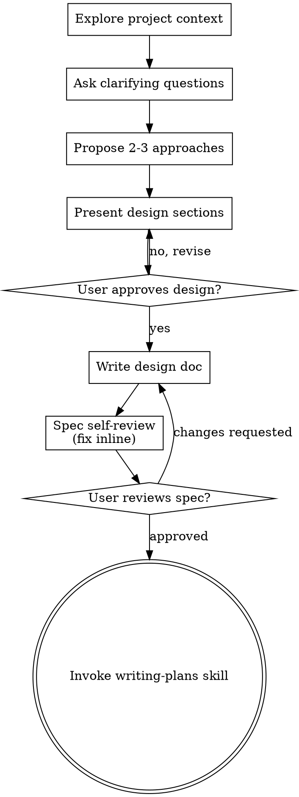

# Переписка — 2026-06-29

_Полный экспорт: текст, вызовы инструментов (команды/правки) и усечённые результаты. Internal reasoning (thinking) опущен._

---

### 🧑 Виталий [Terminal] · 13:36:06 UTC

Готово. Деплой выполнен, ТЗ для superApp написано, закоммичено и запушено.

1. Деплой ✅
   origin/main = 7a2c113 (notifier v1, steps 93–104). TG-сводка ушла в @sqmadminbot. Coolify подхватит автодеплоем.
   ⚠️ Чтобы notifier ожил в проде, нужны твои go-live действия (в плане, раздел «Дальнейшее»): применить миграции 016/017, завести SUPABASE_JWT_SECRET, сервис start:notifier :3403, wss://notify.mrsqm.com.

2. ТЗ для superApp
   Файл: realtime/docs/handoff-notifier-superapp-live-ui.md — самодостаточный контракт (v1), компаньон к v4. Покрывает ровно твой запрос:

A. Счётчики живые ВЕЗДЕ (один источник): notifier шлёт bell.changed (голую подсказку) → superApp на каждое событие + реконнект + poll-60с + возврат фокуса делает один refresh() (параллельно get_bell + get_saved_filters) в единый реактивный стор. Все поверхности (иконка-колокол, бейджи у фильтров, агрегат в меню, tray) читают этот стор и обновляются разом. Жёсткий запрет: счётчики не инкрементить на фронте — только из стора.

B. Как выглядят нотификации — три поверхности с макетами:

Карточка в дропдауне (обязательно):

● ┌──────┐ [New] 2h ago
│ thumb│ 2BR Apartment · For Sale
│ 64×64│ Dubai Marina · Marina Gate
└──────┘ AED 2,100,000
in «2BR Marina under 2.5M»
Состав из полей get_bell: thumb, тег New(зелёный)/Price ↓(оранжевый), title (собирает фронт из bedrooms+unit_type_id+deal_type), локация, цена (для price_drop — ↓ from 2,300,000 зачёркнуто), имя фильтра, относительное время, маркер ● непросмотренного.

Live-toast (рекомендуется): при событии, если окно открыто — компакт «New match» + карточка, либо агрегат «N new matches» если дебаунс схлопнул всплеск.

Нативная Electron-нотификация (опц.): при свёрнутом окне.

Ключевая защита от бага №1 — две прочитанности (Рамка №0): точку колокольчика гасит открытие колокольчика (mark_bell_seen); бейдж «N new» у фильтра гасит просмотр листингов (user_seen_listings). Их нельзя связывать.

Внутри ТЗ: приложения с дословным WS-хендшейком, примером JSON get_bell, эскизом Angular-стора и Definition-of-Done чеклистом. Одна зависимость на их стороне помечена для сверки: get_saved_filters должен отдавать unseen_count (§4.3).

Пам양ть обновил (notifier-design-pending → v1 готов/задеплоен). Отдавать ТЗ в чат superApp можно как есть.

---

### 🤖 Claude · 13:36:51 UTC

Принял хендофф: realtime notifier v1 задеплоен, ТЗ для superApp готово. Go-live действия (миграции 016/017, `SUPABASE_JWT_SECRET`, сервис, WSS-хост) — это realtime/инфра-сторона, не код superApp, тут от меня ничего.

Из всего ТЗ для **нашей** стороны есть **одна помеченная зависимость** — §4.3: `get_saved_filters` должен отдавать `unseen_count`. Это единственное, что стоит сверить у нас прямо сейчас, чтобы хендофф не повис. Проверяю:

---

### 🤖 Claude · 13:36:53 UTC

🔧 **Bash** — Verify get_saved_filters returns unseen_count per ТЗ §4.3

```bash
cd /Users/vitaliinazarov/Projects/superapp
echo '=== get_saved_filters: отдаёт ли unseen_count? (docs/database.md) ==='
grep -n "get_saved_filters\|unseen_count" docs/database.md | head -20
```

---

### 🧑 Виталий [Terminal] · 13:36:53 UTC

<details><summary>↳ результат</summary>

```
=== get_saved_filters: отдаёт ли unseen_count? (docs/database.md) ===
18:| 2026-06-23 | `get_saved_filters()`                                                                          | My-фильтры (`sf.filters->>'scope'='my'`) → `unseen_count=0` (жёлтого бейджа нет). Staleness-proof DO-патч (обёртка re-notify формулы в CASE по scope).                                                                                                                                                                                                                                                                                                                                                                           | `…/applied/2026-06-23-get-saved-filters-my-scope-zero.sql`                                                                                                                         |
21:| 2026-06-22 | `filter_matches`, `mark_listings_shown()` overload, `get_saved_filters()`                      | Стадия 3 + realtime: `filter_matches += matched_at` (NOT NULL DEFAULT now(); matcher realtime пишет на матч/price_drop); перегрузка `mark_listings_shown(uuid[], uuid)` для gpt-бота (GRANT только `service_role`; явный REVOKE с `anon`/`authenticated` — Supabase default-privileges, не PUBLIC); `get_saved_filters.unseen_count` → LIVE COUNT по `MAX(matched_at) > shown_at` (Прил. A, было хранимое `sf.unseen_count`).                                                                                            …[+898 символов]
```

</details>

---

### 🤖 Claude · 13:37:29 UTC

✅ **Зависимость §4.3 у нас уже закрыта.** `get_saved_filters()` отдаёт `unseen_count` — это живой счётчик (`MAX(matched_at) > shown_at`, my-scope=0), сделан ещё в RT-4 ([database.md:21](docs/database.md#L21), [2440](docs/database.md#L2440)). Так что **со стороны superApp данные для ТЗ готовы, DB-правок не нужно**. Хендофф у нас не висит.

Что это значит по работе:

- **Go-live** (миграции 016/017, JWT-secret, сервис notifier, `wss://notify.mrsqm.com`) — realtime/инфра, не мой код. ✅ принял к сведению.
- **Код superApp** = собственно реализовать live-UI колокольчика: WSS-клиент (хендшейк через `Sec-WebSocket-Protocol`) → реактивный стор → `refresh()` (get_bell + get_saved_filters) → карточка в дропдауне + toast + Electron-нотификация. Плюс жёсткое: **не инкрементить счётчики на фронте** и **две прочитанности** (bell-seen ≠ listing-seen, Рамка №0). Это **большой новый таск**.

Один организационный момент: ТЗ лежит в `realtime/docs/` (чужой репо). По нашему правилу «единый источник правды в своём репо» предлагаю **скопировать ТЗ в `superapp/docs/`** (например `docs/superpowers/briefs/`), чтобы superApp-сессии работали со своей копией, и оттуда уже brainstorm → план → SDD.

Как поступим?

---

### 🤖 Claude · 13:37:55 UTC

🔧 **AskUserQuestion** questions=[{"question":"Что делаем с bell live-UI сейчас?","header":"Bell UI","multiSelect …[+603 символов]

---

### 🧑 Виталий [Terminal] · 13:39:20 UTC

<details><summary>↳ результат</summary>

```
Your questions have been answered: "Что делаем с bell live-UI сейчас?"="Начать сейчас (через brainstorm)". You can now continue with these answers in mind.
```

</details>

---

### 🤖 Claude · 13:39:40 UTC

Отлично — начинаем. Сначала прочитаю полное ТЗ из realtime-репо и скопирую его в наш `docs/` (наш источник правды), потом запущу brainstorm по спорным точкам.

Читаю ТЗ:

---

### 🤖 Claude · 13:39:42 UTC

🔧 **Bash** — Check realtime handoff ТЗ file exists

```bash
ls -la /Users/vitaliinazarov/Projects/realtime/docs/handoff-notifier-superapp-live-ui.md 2>&1; echo "---"; wc -l /Users/vitaliinazarov/Projects/realtime/docs/handoff-notifier-superapp-live-ui.md 2>&1
```

---

### 🧑 Виталий [Terminal] · 13:39:43 UTC

<details><summary>↳ результат</summary>

```
-rw-r--r--@ 1 vitaliinazarov  staff  27330 Jun 29 14:39 /Users/vitaliinazarov/Projects/realtime/docs/handoff-notifier-superapp-live-ui.md
---
     274 /Users/vitaliinazarov/Projects/realtime/docs/handoff-notifier-superapp-live-ui.md
```

</details>

---

### 🤖 Claude · 13:39:49 UTC

🔧 **Read** `/Users/vitaliinazarov/Projects/realtime/docs/handoff-notifier-superapp-live-ui.md`

---

### 🧑 Виталий [Terminal] · 13:39:49 UTC

<details><summary>↳ результат</summary>

```
1	# ТЗ superApp: live WS-интеграция — счётчики везде + визуал нотификаций колокольчика
2
3	> Источник истины контракта полей — `docs/handoff-notifier-superapp.md` (v4) + `docs/superpowers/specs/2026-06-24-notifier-design.md`.
4	> Это ТЗ — companion к v4, для чата/команды **superApp** (Angular/Electron, форк Super Productivity). realtime отдаёт сигнал+данные; superApp строит реактивный UI.
5	> **Версия 1 (2026-06-29):** новые поверхности поверх v4 — **(A)** живой refresh ВСЕХ счётчиков (не только точка колокольчика) по одному сигналу; **(B)** точный визуал нотификаций (дропдаун + live-toast + опц. нативная Electron). Поправка к v4 §1A: shipped-сервер шлёт `data: {}` (пустой) — фронт на `data` НЕ опирается.
6	> **ред.2 (2026-06-29, фидбек владельца):** дропдаун колокольчика = **список ФИЛЬТРОВ** (имя фильтра + счётчик фильтра + одна строка про свежий объект), **БЕЗ фото**. `thumb_url` в v1-UI не используется (контракт бэка не меняем).
7
8	Карта поверхностей:
9	- **§2A** — живые счётчики везде (bell-dot + per-filter badges + агрегаты), один реактивный стор.
10	- **§2B** — как ВЫГЛЯДЯТ нотификации: карточка колокольчика, live-toast, нативная OS-нотификация.
11	- **§3** — поведение/краевые (две прочитанности — Рамка №0 — главное).
12
13	---
14
15	## 0. Суть в одном абзаце
16
17	notifier по WebSocket шлёт **`bell.changed`** — голую подсказку «что-то у тебя изменилось, перечитай по REST» (без данных, ради fan-out-safety). superApp на **каждое** такое событие (и на каждом (ре)ко …[+18648 символов]
```

</details>

---

### 🤖 Claude · 13:40:10 UTC

ТЗ прочитано — детальное и самодостаточное. Копирую его в наш репо как источник правды (первоисточник, не пересказ), затем запускаю brainstorm:

---

### 🤖 Claude · 13:40:13 UTC

🔧 **Bash** — Copy ТЗ into superapp docs as source of truth

```bash
cd /Users/vitaliinazarov/Projects/superapp
cp /Users/vitaliinazarov/Projects/realtime/docs/handoff-notifier-superapp-live-ui.md \
   docs/superpowers/briefs/2026-06-29-bell-notifier-superapp-live-ui.md
echo "Скопировано:"; ls -la docs/superpowers/briefs/2026-06-29-bell-notifier-superapp-live-ui.md
echo "--- проверка, что есть и v4-контракт рядом ---"
ls docs/superpowers/briefs/ | grep -i "bell\|notif"
```

---

### 🧑 Виталий [Terminal] · 13:40:15 UTC

<details><summary>↳ результат</summary>

```
Скопировано:
-rw-r--r--@ 1 vitaliinazarov  staff  27463 Jun 29 14:40 docs/superpowers/briefs/2026-06-29-bell-notifier-superapp-live-ui.md
--- проверка, что есть и v4-контракт рядом ---
2026-06-24-bell-notifications-realtime-contract.md
2026-06-29-bell-notifier-superapp-live-ui.md
```

</details>

---

### 🤖 Claude · 13:40:24 UTC

Скопировано в [docs/superpowers/briefs/2026-06-29-bell-notifier-superapp-live-ui.md](docs/superpowers/briefs/2026-06-29-bell-notifier-superapp-live-ui.md) (рядом с v4-контрактом). ТЗ — наш источник правды.

Контракт бэка зафиксирован, но для superApp-стороны есть реальные дизайн-решения (куда вешать колокол, как агрегат считать, toast через существующий SnackService или свой, Electron в v1 или нет, где тумблер живости). Беру brainstorm — это creative work, процесс-скилл идёт первым:

---

### 🤖 Claude · 13:40:24 UTC

🔧 **Skill** skill="superpowers:brainstorming"

---

### 🧑 Виталий [Terminal] · 13:40:24 UTC

Base directory for this skill: /Users/vitaliinazarov/.claude/plugins/cache/claude-plugins-official/superpowers/6.0.3/skills/brainstorming

# Brainstorming Ideas Into Designs

Help turn ideas into fully formed designs and specs through natural collaborative dialogue.

Start by understanding the current project context, then ask questions one at a time to refine the idea. Once you understand what you're building, present the design and get user approval.

<HARD-GATE>
Do NOT invoke any implementation skill, write any code, scaffold any project, or take any implementation action until you have presented a design and the user has approved it. This applies to EVERY project regardless of perceived simplicity.
</HARD-GATE>

## Anti-Pattern: "This Is Too Simple To Need A Design"

Every project goes through this process. A todo list, a single-function utility, a config change — all of them. "Simple" projects are where unexamined assumptions cause the most wasted work. The design can be short (a few sentences for truly simple projects), but you MUST present it and get approval.

## Checklist

You MUST create a task for each of these items and complete them in order:

1. **Explore project context** — check files, docs, recent commits
2. **Offer the visual companion just-in-time** — NOT upfront. The first time a question would genuinely be clearer shown than described, offer it then (its own message); on approval its browser tab opens for you. If no visual question ever arises, never offer it. See the Visual Companion section below.
3. **Ask clarifying questions** — one at a time, understand purpose/constraints/success criteria
4. **Propose 2-3 approaches** — with trade-offs and your recommendation
5. **Present design** — in sections scaled to their complexity, get user approval after each section
6. **Write design doc** — save to `docs/superpowers/specs/YYYY-MM-DD-<topic>-design.md` and commit
7. **Spec self-review** — quick inline check for placeholders, contradictions, ambiguity, scope (see below)
8. **User reviews written spec** — ask user to review the spec file before proceeding
9. **Transition to implementation** — invoke writing-plans skill to create implementation plan

## Process Flow



**The terminal state is invoking writing-plans.** Do NOT invoke frontend-design, mcp-builder, or any other implementation skill. The ONLY skill you invoke after brainstorming is writing-plans.

## The Process

**Understanding the idea:**

- Check out the current project state first (files, docs, recent commits)
- Before asking detailed questions, assess scope: if the request describes multiple independent subsystems (e.g., "build a platform with chat, file storage, billing, and analytics"), flag this immediately. Don't spend questions refining details of a project that needs to be decomposed first.
- If the project is too large for a single spec, help the user decompose into sub-projects: what are the independent pieces, how do they relate, what order should they be built? Then brainstorm the first sub-project through the normal design flow. Each sub-project gets its own spec → plan → implementation cycle.
- For appropriately-scoped projects, ask questions one at a time to refine the idea
- Prefer multiple choice questions when possible, but open-ended is fine too
- Only one question per message - if a topic needs more exploration, break it into multiple questions
- Focus on understanding: purpose, constraints, success criteria

**Exploring approaches:**

- Propose 2-3 different approaches with trade-offs
- Present options conversationally with your recommendation and reasoning
- Lead with your recommended option and explain why

**Presenting the design:**

- Once you believe you understand what you're building, present the design
- Scale each section to its complexity: a few sentences if straightforward, up to 200-300 words if nuanced
- Ask after each section whether it looks right so far
- Cover: architecture, components, data flow, error handling, testing
- Be ready to go back and clarify if something doesn't make sense

**Design for isolation and clarity:**

- Break the system into smaller units that each have one clear purpose, communicate through well-defined interfaces, and can be understood and tested independently
- For each unit, you should be able to answer: what does it do, how do you use it, and what does it depend on?
- Can someone understand what a unit does without reading its internals? Can you change the internals without breaking consumers? If not, the boundaries need work.
- Smaller, well-bounded units are also easier for you to work with - you reason better about code you can hold in context at once, and your edits are more reliable when files are focused. When a file grows large, that's often a signal that it's doing too much.

**Working in existing codebases:**

- Explore the current structure before proposing changes. Follow existing patterns.
- Where existing code has problems that affect the work (e.g., a file that's grown too large, unclear boundaries, tangled responsibilities), include targeted improvements as part of the design - the way a good developer improves code they're working in.
- Don't propose unrelated refactoring. Stay focused on what serves the current goal.

## After the Design

**Documentation:**

- Write the validated design (spec) to `docs/superpowers/specs/YYYY-MM-DD-<topic>-design.md`
  - (User preferences for spec location override this default)
- Use elements-of-style:writing-clearly-and-concisely skill if available
- Commit the design document to git

**Spec Self-Review:**
After writing the spec document, look at it with fresh eyes:

1. **Placeholder scan:** Any "TBD", "TODO", incomplete sections, or vague requirements? Fix them.
2. **Internal consistency:** Do any sections contradict each other? Does the architecture match the feature descriptions?
3. **Scope check:** Is this focused enough for a single implementation plan, or does it need decomposition?
4. **Ambiguity check:** Could any requirement be interpreted two different ways? If so, pick one and make it explicit.

Fix any issues inline. No need to re-review — just fix and move on.

**User Review Gate:**
After the spec review loop passes, ask the user to review the written spec before proceeding:

> "Spec written and committed to `<path>`. Please review it and let me know if you want to make any changes before we start writing out the implementation plan."

Wait for the user's response. If they request changes, make them and re-run the spec review loop. Only proceed once the user approves.

**Implementation:**

- Invoke the writing-plans skill to create a detailed implementation plan
- Do NOT invoke any other skill. writing-plans is the next step.

## Key Principles

- **One question at a time** - Don't overwhelm with multiple questions
- **Multiple choice preferred** - Easier to answer than open-ended when possible
- **YAGNI ruthlessly** - Remove unnecessary features from all designs
- **Explore alternatives** - Always propose 2-3 approaches before settling
- **Incremental validation** - Present design, get approval before moving on
- **Be flexible** - Go back and clarify when something doesn't make sense

## Visual Companion

A browser-based companion for showing mockups, diagrams, and visual options during brainstorming. Available as a tool — not a mode. Accepting the companion means it's available for questions that benefit from visual treatment; it does NOT mean every question goes through the browser.

**Offering the companion (just-in-time):** Do NOT offer it upfront. Wait until a question would genuinely be clearer shown than told — a real mockup / layout / diagram question, not merely a UI _topic_. The first time that happens, offer it then, as its own message:

> "This next part might be easier if I show you — I can put together mockups, diagrams, and comparisons in a browser tab as we go. It's still new and can be token-intensive. Want me to? I'll open it for you."

**This offer MUST be its own message.** Only the offer — no clarifying question, summary, or other content. Wait for the user's response. If they accept, start the server with `--open` so their browser opens to the first screen automatically. If they decline, continue text-only and don't offer again unless they raise it.

**Per-question decision:** Even after the user accepts, decide FOR EACH QUESTION whether to use the browser or the terminal. The test: **would the user understand this better by seeing it than reading it?**

- **Use the browser** for content that IS visual — mockups, wireframes, layout comparisons, architecture diagrams, side-by-side visual designs
- **Use the terminal** for content that is text — requirements questions, conceptual choices, tradeoff lists, A/B/C/D text options, scope decisions

A question about a UI topic is not automatically a visual question. "What does personality mean in this context?" is a conceptual question — use the terminal. "Which wizard layout works better?" is a visual question — use the browser.

If they agree to the companion, read the detailed guide before proceeding:
`skills/brainstorming/visual-companion.md`

---

### 🧑 Виталий [Terminal] · 13:40:24 UTC

<details><summary>↳ результат</summary>

```
Launching skill: superpowers:brainstorming
```

</details>

---

### 🤖 Claude · 13:40:56 UTC

Контекст ТЗ и кодовой базы у меня уже большой (right-panel, SnackService, supabase.service, get_saved_filters). Догружу точечно поверхности, которые задаёт ТЗ, чтобы вопросы были предметными: где тулбар/хедер MrSQM (куда вешать колокол), сайдбар сохранённых фильтров (бейджи), как зовём RPC + берём JWT, есть ли Electron-Notification, паттерн localStorage-тумблера:

---

### 🤖 Claude · 13:41:02 UTC

🔧 **Bash** — Explore bell-relevant SP/MrSQM surfaces

```bash
cd /Users/vitaliinazarov/Projects/superapp
echo '=== MrSQM тулбар/хедер (где SC-7 селектор города, куда мог бы лечь колокол) ==='
grep -rln "toolbar\|city-selector\|mrsqm-toolbar\|feed-toolbar" src/app/mrsqm --include='*.ts' --include='*.html' | head
echo
echo '=== сохранённые фильтры (сайдбар/бейджи unseen_count) ==='
grep -rln "saved-filter\|savedFilters\|unseen_count\|SavedFilter" src/app/mrsqm --include='*.ts' --include='*.html' | grep -iv spec | head
echo
echo '=== supabase.service: rpc + сессия/JWT ==='
grep -rn "rpc<\|\.rpc(\|getSession\|access_token\|auth.getSession\|session()" src/app/mrsqm/services/*supabase*.ts | head
echo
echo '=== Electron Notification / IS_ELECTRON ==='
grep -rln "IS_ELECTRON" src/app/mrsqm --include='*.ts' | head -3; grep -rn "new Notification\|electron.*[Nn]otif" src/app --include='*.ts' | head
```

---

### 🧑 Виталий [Terminal] · 13:41:03 UTC

<details><summary>↳ результат</summary>

```
=== MrSQM тулбар/хедер (где SC-7 селектор города, куда мог бы лечь колокол) ===
src/app/mrsqm/pages/feed/feed-page.component.html

=== сохранённые фильтры (сайдбар/бейджи unseen_count) ===
src/app/mrsqm/types/database.ts
src/app/mrsqm/components/feed-filter-panel/feed-filter-panel.component.html
src/app/mrsqm/components/feed-filter-panel/feed-filter-panel.component.ts
src/app/mrsqm/pages/feed/feed-page.component.ts
src/app/mrsqm/services/saved-filter.service.ts
src/app/mrsqm/services/feed-filter.service.ts

=== supabase.service: rpc + сессия/JWT ===
src/app/mrsqm/services/supabase.service.ts:14:  async rpc<T = unknown>(fn: string, params?: Record<string, unknown>): Promise<T> {
src/app/mrsqm/services/supabase.service.ts:15:    const { data, error } = await this.client.rpc(fn, params);

=== Electron Notification / IS_ELECTRON ===
src/app/core/notify/notify.service.ts:91:        const instance = new Notification(title, {
```

</details>

---

### 🤖 Claude · 13:42:24 UTC

Принял апдейт ТЗ (ред.2). Сверился — **файл, что я скопировал в наш репо, уже эта версия** (дропдаун = список фильтров, без фото, changelog ред.2 на месте). Так что мы в синхроне с `0618932`.

И **§4.3 у нас закрыто**: `get_saved_filters` уже отдаёт `unseen_count` (живой счётчик, RT-4) — тот самый «счётчик фильтра» в строке. Добавлять ничего не нужно.

**Да, дай** точный текст пустого состояния + поведение «счётчик есть, а свежего объекта в `get_bell` уже нет (старый матч)» — это ровно дизайн строки дропдауна, лучше взять из контракта, чем додумывать. Жду, вложу в спеку.

Пока это готовишь — двигаю brainstorm по тому, что от твоего edge-кейса не зависит. Контекст кодовой базы я уже снял: тулбар MrSQM в [feed-page](src/app/mrsqm/pages/feed/feed-page.component.html), бейджи фильтров уже живут (RT-4), RPC — через `supabase.service.rpc()`, и **в SP уже есть** [notify.service](src/app/core/notify/notify.service.ts) с `new Notification(...)` — переиспользуем для нативной нотификации.

Первый вопрос — объём v1. Важный контекст: `get_bell` + WSS в проде ещё не живые (твой go-live впереди), поэтому строим **против контракта** — счётчики работают уже сейчас в poll-режиме (через живой `get_saved_filters`), а точка-колокол/дропдаун-объекты/WS-пуш оживают после применения 016/017 + WSS.

---

### 🤖 Claude · 13:42:45 UTC

🔧 **AskUserQuestion** questions=[{"question":"Какой объём берём в v1 (Electron-нотификация в ТЗ помечена «опц.») …[+586 символов]

---

### 🧑 Виталий [Terminal] · 13:43:20 UTC

<details><summary>↳ результат</summary>

```
Your questions have been answered: "Какой объём берём в v1 (Electron-нотификация в ТЗ помечена «опц.»)?"="Ядро + toast (рекомендую)". You can now continue with these answers in mind.
```

</details>

---

### 🤖 Claude · 13:43:42 UTC

Объём — ядро + toast, Electron позже. Принял.

Следующий вопрос — **куда вешать глобальный колокол** и какие счётчик-поверхности у нас реально есть (чтобы не проектировать несуществующие). Гляну тулбар ленты и сайд-нав:

---

### 🤖 Claude · 13:43:45 UTC

🔧 **Bash** — Inspect feed-page toolbar structure for bell placement

```bash
cd /Users/vitaliinazarov/Projects/superapp
echo '=== тулбар в feed-page (первые ~60 строк шапки) ==='
sed -n '1,70p' src/app/mrsqm/pages/feed/feed-page.component.html | grep -nE "toolbar|button|mat-icon|class=|<header|notif|bell|filter|city|saved" | head -40
```

---

### 🧑 Виталий [Terminal] · 13:43:45 UTC

<details><summary>↳ результат</summary>

```
=== тулбар в feed-page (первые ~60 строк шапки) ===
1:<div class="feed-container">
4:  <div class="feed-toolbar">
6:    <button
7:      type="button"
8:      class="tb-select scope-select"
9:      [class.isActive]="filter.scope() !== 'public'"
14:      <span class="scope-count">{{ foundCount() | number }}</span>
15:      <mat-icon>arrow_drop_down</mat-icon>
16:    </button>
19:      class="tb-menu"
22:        <button
24:          [class.tb-menu-selected]="filter.scope() === o.value"
27:          @if (filter.scope() === o.value) {
28:            <mat-icon class="tb-menu-check">check</mat-icon>
31:        </button>
36:    <div class="tb-search">
37:      <mat-icon class="tb-search-icon">place</mat-icon>
39:      @if (filter.agentQuery(); as ag) {
41:        <span class="tb-chip">
42:          <mat-icon>person</mat-icon>{{ ag }}
43:          <button
44:            type="button"
45:            class="tb-chip-x"
49:            <mat-icon>close</mat-icon>
50:          </button>
54:        <div class="tb-loc-inline">
55:          @if (filter.locationFilters().length > 0) {
58:            <span class="tb-chip">
59:              <span class="tb-chip-label">{{ filter.locationFilters()[0].name }}</span>
60:              <button
61:                type="button"
62:                class="tb-chip-x"
63:                (click)="removeLocation(filter.locationFilters()[0].id)"
64:                [attr.aria-label]="'Убрать адрес ' + filter.locationFilters()[0].name"
66:                <mat-icon …[+44 символов]
```

</details>

---

### 🤖 Claude · 13:43:53 UTC

🔧 **Bash** — Inspect right side of toolbar for action buttons

```bash
cd /Users/vitaliinazarov/Projects/superapp
echo '=== тулбар: правая часть (кнопки-действия) ==='
sed -n '70,140p' src/app/mrsqm/pages/feed/feed-page.component.html | grep -nE "button|mat-icon|class=\"tb|filter|saved|notif|bell|aria-label" | head -40
echo
echo '=== где открывается панель фильтров / сохранённые фильтры (кнопка) ==='
grep -nE "openFilter|filter-panel|saved|toggleFilter|tb-action|tb-btn" src/app/mrsqm/pages/feed/feed-page.component.html | head
```

---

### 🧑 Виталий [Terminal] · 13:43:53 UTC

<details><summary>↳ результат</summary>

```
=== тулбар: правая часть (кнопки-действия) ===
3:          @if (filter.locationFilters().length < filter.MAX_LOCATIONS) {
6:              class="tb-search-input"
8:                filter.locationFilters().length ? 'Ещё адрес' : 'Адрес или агент'
19:        @if (filter.locationFilters().length >= 2 || locExpanded()) {
20:          <button
21:            type="button"
22:            class="tb-loc-toggle"
24:            [attr.aria-label]="
29:              <span class="tb-loc-count">+{{ locHiddenCount() }}</span>
31:            <mat-icon>{{
33:            }}</mat-icon>
34:          </button>
40:        <div class="tb-suggest">
42:            <div class="tb-suggest-group">Адреса</div>
44:              <button
45:                type="button"
46:                class="tb-suggest-item"
49:                <mat-icon>place</mat-icon>
53:                <span class="tb-suggest-name">
54:                  <span class="tb-suggest-leaf">{{ l.name }}</span>
56:                    <span class="tb-suggest-sub"
61:              </button>
65:            <div class="tb-suggest-group">Агенты</div>
67:              <button
68:                type="button"
69:                class="tb-suggest-item"

=== где открывается панель фильтров / сохранённые фильтры (кнопка) ===
359:        (click)="toggleFilterPanel()"
369:        (click)="toggleFilterPanel()"
423:        [isSaved]="savedIds().has(p.id)"
```

</details>

---

### 🤖 Claude · 13:43:59 UTC

🔧 **Read** `/Users/vitaliinazarov/Projects/superapp/src/app/mrsqm/pages/feed/feed-page.component.html` (offset 345, limit 35)

---

### 🧑 Виталий [Terminal] · 13:43:59 UTC

<details><summary>↳ результат</summary>

```
345	        >
346	          @if (filter.sortBy() === o.value) {
347	            <mat-icon class="tb-menu-check">check</mat-icon>
348	          }
349	          <span>{{ o.label }}</span>
350	        </button>
351	      }
352	    </mat-menu>
353
354	    <!-- 7. Фильтры: при активных — чип с количеством, иначе — кнопка в рамке (U-11) -->
355	    @if (filter.activeFilterCount() > 0) {
356	      <button
357	        type="button"
358	        class="filter-chip"
359	        (click)="toggleFilterPanel()"
360	        [attr.aria-label]="'Фильтры (активны)'"
361	      >
362	        <mat-icon>tune</mat-icon>
363	        <span>{{ filter.activeFilterCount() }}</span>
364	      </button>
365	    } @else {
366	      <button
367	        type="button"
368	        class="tb-icon-btn"
369	        (click)="toggleFilterPanel()"
370	        [attr.aria-label]="'Фильтры'"
371	        title="Фильтры"
372	      >
373	        <mat-icon>tune</mat-icon>
374	      </button>
375	    }
376
377	    <!-- 8. «Поделиться» выбранным: появляется при отмеченных чекбоксах, справа от
378	         фильтра, подсвечена акцентом. Логика — позже. Место забирает поле поиска. -->
379	    @if (selection.count() > 0) {
```

</details>

---

### 🤖 Claude · 13:44:53 UTC

Тулбар ленты понятен (scope ▾, поиск, сорт, кнопка фильтров `tune`, share). Колокол логично сюда. Но ТЗ говорит «хедер» = глобально. Проверю, есть ли у MrSQM глобальный нав (сайд/боттом), чтобы предложить конкретный второй вариант:

---

### 🤖 Claude · 13:44:57 UTC

🔧 **Bash** — Find MrSQM global navigation surface for bell placement

```bash
cd /Users/vitaliinazarov/Projects/superapp
echo '=== MrSQM-навигация: где пункты Лента/Чат/Профиль (сайд/боттом-нав)? ==='
grep -rln "mrsqm/feed\|mrsqm/chat\|mrsqm/profile\|mrsqm/add" src/app --include='*.html' --include='*.ts' | grep -iv "spec\|app.routes\|pages/" | head
echo
echo '=== есть ли MrSQM-shell/nav-компонент? ==='
find src/app/mrsqm -iname '*nav*' -o -iname '*shell*' -o -iname '*layout*' | head
echo '=== SP side-nav: туда добавляют пункты? ==='
grep -rln "magic-side-nav\|MagicSideNav\|mrsqm" src/app/core-ui/magic-side-nav 2>/dev/null | head; ls src/app/core-ui/magic-side-nav 2>/dev/null | head
```

---

### 🧑 Виталий [Terminal] · 13:44:59 UTC

<details><summary>↳ результат</summary>

```
=== MrSQM-навигация: где пункты Лента/Чат/Профиль (сайд/боттом-нав)? ===
src/app/core-ui/main-header/main-header.component.ts
src/app/core-ui/magic-side-nav/magic-nav-config.service.ts
src/app/mrsqm/components/property-detail/property-detail.component.ts

=== есть ли MrSQM-shell/nav-компонент? ===
=== SP side-nav: туда добавляют пункты? ===
src/app/core-ui/magic-side-nav/magic-side-nav.component.ts
src/app/core-ui/magic-side-nav/nav-item/nav-item.component.ts
src/app/core-ui/magic-side-nav/magic-side-nav.component.scss
src/app/core-ui/magic-side-nav/magic-nav-config.service.ts
src/app/core-ui/magic-side-nav/nav-item/nav-item.component.scss
src/app/core-ui/magic-side-nav/nav-list/nav-list-tree.component.ts
src/app/core-ui/magic-side-nav/nav-mat-menu/nav-mat-menu.component.ts
magic-nav-config.service.ts
magic-side-nav.animations.ts
magic-side-nav.component.html
magic-side-nav.component.scss
magic-side-nav.component.ts
magic-side-nav.model.ts
nav-item
nav-list
nav-mat-menu
```

</details>

---

### 🤖 Claude · 13:45:27 UTC

MrSQM использует глобальные `main-header` (верхний хедер) и `magic-side-nav` (нав-пункты Лента/Чат/Профиль в `magic-nav-config`). И `main-header` уже знает про mrsqm — гляну, есть ли там готовая точка интеграции (чтобы «глобальный колокол» был чистым, а не хирургией апстрима):

---

### 🤖 Claude · 13:45:30 UTC

🔧 **Bash** — Check main-header mrsqm integration and nav-item badge support

```bash
cd /Users/vitaliinazarov/Projects/superapp
echo '=== main-header: что про mrsqm ==='
grep -n "mrsqm\|Mrsqm\|isMrsqm\|page ===" src/app/core-ui/main-header/main-header.component.ts | head
echo '=== main-header вообще показывается на mrsqm-экранах? (template) ==='
grep -n "mrsqm\|@if\|isShow\|isHidden\|*ngIf" src/app/core-ui/main-header/main-header.component.html 2>/dev/null | head
echo '=== magic-nav-config: пункты mrsqm + есть ли badge у nav-item ==='
grep -n "mrsqm\|badge\|label:\|icon:" src/app/core-ui/magic-side-nav/magic-nav-config.service.ts | head -20
```

---

### 🧑 Виталий [Terminal] · 13:45:35 UTC

<details><summary>↳ результат</summary>

```
=== main-header: что про mrsqm ===
48:import { FeedFilterService } from '../../mrsqm/services/feed-filter.service';
130:      map((event) => event.urlAfterRedirects.startsWith('/mrsqm/feed')),
131:      startWith(this._router.url.startsWith('/mrsqm/feed')),
133:    { initialValue: this._router.url.startsWith('/mrsqm/feed') },
=== main-header вообще показывается на mrsqm-экранах? (template) ===
=== magic-nav-config: пункты mrsqm + есть ли badge у nav-item ===
36:import { MrsqmAuthService } from '../../mrsqm/services/auth.service';
53:  private readonly _mrsqmAuth = inject(MrsqmAuthService);
147:        label: 'Лента',
148:        icon: 'apartment',
149:        route: '/mrsqm/feed',
154:        label: 'Добавить',
155:        icon: 'add_home',
156:        route: '/mrsqm/add',
161:        label: 'Сеть',
162:        icon: 'group',
163:        route: '/mrsqm/network',
168:        label: 'AI Chat',
169:        icon: 'smart_toy',
170:        route: '/mrsqm/chat',
175:        label: 'Профиль',
176:        icon: 'person',
177:        route: '/mrsqm/profile',
182:        label: 'Выйти',
183:        icon: 'logout',
209:              label: T.MH.SEARCH,
```

</details>

---

### 🤖 Claude · 13:46:12 UTC

Точки интеграции ясны: `main-header` **уже** MrSQM-интегрирован (знает про `/mrsqm/feed`), а сайд-нав конфигурится в `magic-nav-config` (Лента/Добавить/Сеть/AI Chat/Профиль). Значит «глобальный колокол» можно сделать чисто.

Вопрос по размещению колокола (ключевой UX-форк):

---

### 🤖 Claude · 13:46:54 UTC

🔧 **AskUserQuestion** questions=[{"question":"Где живёт глобальный колокол с точкой/числом и дропдауном?","heade …[+1071 символов]

---

### 🧑 Виталий [Terminal] · 13:55:51 UTC

<details><summary>↳ результат</summary>

```
Your questions have been answered: "Где живёт глобальный колокол с точкой/числом и дропдауном?"="в хедеде справа от иконки GPT - тоже серая но если есть непрочитанные уведомления то она оранжевая и со счетчиком общее количество непросмотренных уведомлений ". You can now continue with these answers in mind.
```

</details>

---

### 🤖 Claude · 13:56:09 UTC

Понял — колокол в хедере **справа от иконки GPT**: по умолчанию серый (как GPT), при непрочитанных — **оранжевый + счётчик** (общее число непросмотренных = `bell_unseen`, cap 99+). Это и резолвит §3.10: отдельного «агрегата в меню» не делаем — колокол в хедере и есть глобальный счётчик.

Найду иконку GPT в хедере, чтобы знать точное место:

---

### 🤖 Claude · 13:56:12 UTC

🔧 **Bash** — Find GPT icon in main-header to place bell next to it

```bash
cd /Users/vitaliinazarov/Projects/superapp
echo '=== файлы main-header ==='
ls src/app/core-ui/main-header/
echo '=== иконка GPT/AI/chat в хедере ==='
grep -rniE "gpt|smart_toy|ai.?chat|chat|robot|assistant" src/app/core-ui/main-header/*.html src/app/core-ui/main-header/*.ts 2>/dev/null | head
echo '=== вообще кнопки/иконки в шапке (template) ==='
grep -rnE "mat-icon|<button|click" src/app/core-ui/main-header/main-header.component.html 2>/dev/null | head -25
```

---

### 🧑 Виталий [Terminal] · 13:56:15 UTC

<details><summary>↳ результат</summary>

```
=== файлы main-header ===
desktop-panel-buttons
focus-button
main-header.component.html
main-header.component.scss
main-header.component.spec.ts
main-header.component.ts
mobile-side-panel-menu
page-title
play-button
=== иконка GPT/AI/chat в хедере ===
=== вообще кнопки/иконки в шапке (template) ===
src/app/core-ui/main-header/main-header.component.html:26:            <mat-icon class="feed-search-ico">search</mat-icon>
src/app/core-ui/main-header/main-header.component.html:36:            <button
src/app/core-ui/main-header/main-header.component.html:37:              mat-icon-button
src/app/core-ui/main-header/main-header.component.html:39:              (click)="toggleSearch()"
src/app/core-ui/main-header/main-header.component.html:42:              <mat-icon>close</mat-icon>
src/app/core-ui/main-header/main-header.component.html:47:          <button
src/app/core-ui/main-header/main-header.component.html:49:            mat-icon-button
src/app/core-ui/main-header/main-header.component.html:50:            (click)="toggleSearch()"
src/app/core-ui/main-header/main-header.component.html:54:            <mat-icon>search</mat-icon>
src/app/core-ui/main-header/main-header.component.html:60:      <button
src/app/core-ui/main-header/main-header.component.html:61:        (click)="layoutService.showAddTaskBar()"
src/app/core-ui/main-header/main-header.component.html:66:        mat-icon-button
src/app/core-ui/main-header/main-header.component.html:68:        <mat-icon>add</mat-icon>
src/app/c …[+412 символов]
```

</details>

---

### 🤖 Claude · 13:56:27 UTC

`main-header.component.html` штатно про GPT/чат не упоминает — значит «иконка GPT» это MrSQM-кнопка открытия AI-чата, добавленная где-то в шапку. Найду её (через `isAiChatOpen`/toggle чата):

---

### 🤖 Claude · 13:56:29 UTC

🔧 **Bash** — Find the GPT/AI chat button in the header

```bash
cd /Users/vitaliinazarov/Projects/superapp
echo '=== кнопка открытия AI-чата (GPT) — где в шапке ==='
grep -rnE "isAiChatOpen|openAiChat|toggleAiChat|AiChat|smart_toy|aiChat" src/app --include='*.html' --include='*.ts' | grep -iv "spec\|chat-page\|panel-content.service\|magic-nav" | head -15
```

---

### 🧑 Виталий [Terminal] · 13:56:30 UTC

<details><summary>↳ результат</summary>

```
=== кнопка открытия AI-чата (GPT) — где в шапке ===
src/app/app.routes.ts:179:    data: { page: 'mrsqm-chat', title: 'AI Chat', icon: 'smart_toy' },
src/app/ui/material-icons.const.ts:3065:  'smart_toy',
src/app/core-ui/main-header/desktop-panel-buttons/desktop-panel-buttons.component.ts:39:      [class.isActive]="panelContentService.isAiChatOpen()"
src/app/core-ui/main-header/desktop-panel-buttons/desktop-panel-buttons.component.ts:40:      (click)="panelContentService.toggleAiChat()"
src/app/core-ui/main-header/desktop-panel-buttons/desktop-panel-buttons.component.ts:44:      <mat-icon>smart_toy</mat-icon>
src/app/core-ui/main-header/desktop-panel-buttons/desktop-panel-buttons.component.ts:111:        /* AI-кнопка: smart_toy не вращается (rotate — только для plus-иконок),
src/app/features/right-panel/right-panel-content.component.ts:193:    const isAiChatOpen = this._panelContentService.isAiChatOpen();
src/app/features/right-panel/right-panel-content.component.ts:200:        isAiChatOpen ||
src/app/features/right-panel/right-panel-content.component.ts:306:    this._panelContentService.closeAiChat();
```

</details>

---

### 🤖 Claude · 13:56:38 UTC

Нашёл: иконка GPT = `smart_toy` в [desktop-panel-buttons.component.ts](src/app/core-ui/main-header/desktop-panel-buttons/desktop-panel-buttons.component.ts) (хедер, кнопка открытия AI-чата). Колокол — справа от неё. Читаю компонент, чтобы понять структуру (стиль, состояния):

---

### 🤖 Claude · 13:56:38 UTC

🔧 **Read** `/Users/vitaliinazarov/Projects/superapp/src/app/core-ui/main-header/desktop-panel-buttons/desktop-panel-buttons.component.ts`

---

### 🧑 Виталий [Terminal] · 13:56:39 UTC

<details><summary>↳ результат</summary>

```
1	import {
2	  ChangeDetectionStrategy,
3	  Component,
4	  computed,
5	  inject,
6	  input,
7	} from '@angular/core';
8	import { MatIconButton } from '@angular/material/button';
9	import { MatIcon } from '@angular/material/icon';
10	import { MatTooltip } from '@angular/material/tooltip';
11	import { TranslatePipe } from '@ngx-translate/core';
12	import { LayoutService } from '../../layout/layout.service';
13	import { T } from '../../../t.const';
14	import { KeyboardConfig } from '../../../features/config/keyboard-config.model';
15	import { GlobalConfigService } from '../../../features/config/global-config.service';
16	import { PanelContentService } from '../../../features/panels/panel-content.service';
17
18	@Component({
19	  selector: 'desktop-panel-buttons',
20	  standalone: true,
21	  imports: [MatIconButton, MatIcon, MatTooltip, TranslatePipe],
22	  template: `
23	    @if (isScheduleDayPanelEnabled()) {
24	      <button
25	        class="panel-btn e2e-toggle-schedule-day-panel"
26	        [disabled]="!isRouteWithSidePanel()"
27	        [class.isActive]="isShowScheduleDayPanel()"
28	        (click)="layoutService.toggleScheduleDayPanel()"
29	        mat-icon-button
30	        matTooltip="{{ T.MH.SCHEDULE | translate }}"
31	      >
32	        <mat-icon>schedule</mat-icon>
33	      </button>
34	    }
35
36	    <!-- MrSQM: AI-чат в правой панели — кнопка справа от календаря, видна всегда -->
37	    <button
38	      class="panel-btn ai-panel-btn"
39	      [class.isActive]="p …[+4025 символов]
```

</details>

---

### 🤖 Claude · 13:58:25 UTC

Нашёл точку: GPT-иконка = `smart_toy` в [desktop-panel-buttons.component.ts](src/app/core-ui/main-header/desktop-panel-buttons/desktop-panel-buttons.component.ts) (этот файл **уже** MrSQM-кастомизирован — там и живёт AI-кнопка). Колокол встаёт справа от неё, минимальной вставкой `<mrsqm-bell-button>`, а вся логика — в `src/app/mrsqm/`.

У меня достаточно для дизайна. Вот предлагаемая архитектура — глянь по разделам:

## Дизайн: live-колокольчик superApp

### 1. Компоненты (узкие роли)

| Юнит                      | Где                | Что делает                                                                                                                                                                                                                                                   |
| ------------------------- | ------------------ | ------------------------------------------------------------------------------------------------------------------------------------------------------------------------------------------------------------------------------------------------------------ |
| **NotifierSocketService** | `mrsqm/services`   | Только WebSocket: коннект с JWT в subprotocol, backoff+jitter реконнект, свежий токен на каждый коннект. Эмитит «changed» на событие и на (ре)open. Без состояния/UI.                                                                                        |
| **NotifierStore**         | `mrsqm/services`   | **Единственный источник**: сигналы `bell{bell_unseen,items}` + `filters`. `refresh()` = параллельно `get_bell`+`get_saved_filters` → запись в сигналы. Триггеры: changed / reopen / poll-60с / focus. `openBell()` = `mark_bell_seen`+refresh.               |
| **mrsqm-bell-button**     | `mrsqm/components` | Иконка в хедере справа от GPT: серая по умолчанию, **оранжевая + число** при `bell_unseen>0` (cap 99+). Открывает дропдаун.                                                                                                                                  |
| **mrsqm-bell-dropdown**   | `mrsqm/components` | Список фильтров: строка = имя + бейдж `unseen_count` + строка свежего объекта (тег·title·локация·цена). Заголовок + «Mark all read». Состояния loading/empty/error. Рендер через top-layer `<dialog>` (иначе right-panel запирает оверлей — известная гоча). |

### 2. Поток данных

Любой триггер → `store.refresh()` → сигналы `bell`+`filters` обновляются → **разом** перерисовываются: колокол (точка/число), дропдаун (строки), бейджи фильтров в сайдбаре. **Ни одна поверхность не считает сама** — только читает стор.

### 3. Две прочитанности (Рамка №0) — жёстко

- Открытие колокола / «Mark all read» → `mark_bell_seen()` → гаснет **только оранжевая точка/число** (bell-seen). Объекты НЕ метит.
- Бейдж `unseen_count` у фильтра гаснет **отдельно** — просмотром листингов (существующий `user_seen_listings`). Никогда не связываем.

### 4. Мои рекомендации по мелочам (скажи, если против)

- **Toast** — переиспользую существующий `SnackService` (`mrsqm-snack`, низ-лево). ред.2 сделал тост текстовым без фото → snackbar идеально подходит, свой компонент не нужен.
- **Тумблер живости** — localStorage, переключатель в шапке дропдауна колокола (там, где уведомления). OFF → нет сокета/тостов, но счётчики живые через poll+focus.
- **JWT для WS** — беру из Supabase-сессии (`supabase.service`), свежий на каждый коннект.

### 5. Фазность (что работает когда)

- **Уже сегодня** (poll-режим): `get_saved_filters` живой → бейджи фильтров + строки-фильтры в дропдауне работают. `refresh()` устойчив к отсутствию `get_bell` (try/catch → колокол=0, фильтры живут).
- **После твоего go-live** (016/017 + WSS): оживают `bell_unseen`/items + WS-пуш + тосты.

### 6. Касание апстрима — минимальное

Только одна вставка `<mrsqm-bell-button>` в `desktop-panel-buttons` рядом с AI-кнопкой (файл уже MrSQM-кастомный). Вся логика — в `mrsqm/`.

---

⏳ Жду от тебя обещанный edge-кейс (текст пустого состояния + «счётчик есть, свежего объекта нет») — вложу в строку дропдауна.

Дизайн в целом такой? Если ок (и по мелочам из п.4 согласен) — оформляю спеку в `docs/superpowers/specs/` и дальше план. Если что-то поправить — скажи.

---

### 🧑 Виталий [Terminal] · 14:42:06 UTC

📨 Для команды superApp — live-уведомления (колокольчик): что готово и что строить

Что сделано на стороне realtime (готово, задеплоено):
WebSocket-шлюз notifier + read-модель колокольчика. Шлёт браузеру лёгкую подсказку bell.changed, по которой вы перечитываете данные через REST. Бэкенд прошёл несколько итераций по модели «прочитанности» — итоговая зафиксирована (ред.5), описана ниже.

Где смотреть (единственный источник истины — самодостаточное ТЗ):
realtime/docs/handoff-notifier-superapp-live-ui.md (ред.5). Там всё: поля-контракт (§1), что строить (§2), поведение/краевые (§3), зависимости (§4), WS-хендшейк + пример JSON + эскиз Angular-стора + Definition of Done (приложения A–D).

Главное — ДВА НЕЗАВИСИМЫХ сигнала (не путать):

🔔 Уведомления 🏠 Объекты
Что непросмотренные уведомления непросмотренные объекты (недвижка)
Где бейдж на колокольчике + 🟠 точка у каждого бейдж-счётчик у каждого фильтра
Источник get_bell().bell_unseen + get_bell().items[].unseen get_saved_filters().unseen_count
Гаснет при закрытии колокольчика (mark_bell_seen) → бейдж=0 и все точки при открытии самого объекта (вы пишете user_seen_listings)
Закрыл колокольчик → уведомления просмотрены (бейдж 0, точки погасли), но счётчики объектов у фильтров остаются, пока не перешёл в объекты. Это разные числа.

Как выглядит финальное окно уведомлений (дропдаун колокольчика, БЕЗ фото):

🔔 Notifications
┌──────────────────────────────────────────────────┐
│ 🟠 2BR Marina under 2.5M (3) │
│ New · 2BR Apartment · Dubai Marina · AED 2.1M │
├──────────────────────────────────────────────────┤
│ 🟠 Villas Arabian Ranches (1) │
│ Price ↓ · 4BR Villa · Arabian Ranches · 2.1M │
└──────────────────────────────────────────────────┘
Одна строка = один фильтр, три элемента:

🟠 Оранжевая точка — если у фильтра есть непросмотренное уведомление (item.unseen=true). Гаснет при закрытии колокольчика.
Имя фильтра + справа счётчик объектов (N) = unseen_count (тот же, что бейдж у фильтра в сайдбаре; гаснет при открытии объекта).
Строка за свежий объект: {тег New/Price↓} · {title} · {локация} · {цена}. title собираете своим хелпером ленты ({bedrooms}BR {unitType}); для price_drop цена AED 2.1M (was 2.3M).
Клик по строке → объект открывается в sidebar (это «просмотр объекта» → unseen_count −1).
Пусто: No new matches / нет фильтров: No saved filters yet + Create filter.
Что строите вы (кратко, полностью — в §2 ТЗ):
WS-клиент (JWT в Sec-WebSocket-Protocol, авто-реконнект, на каждом open → refresh()); единый реактивный стор; живые счётчики на всех поверхностях (колокол, сайдбар-фильтры, агрегат, tray); дропдаун выше; (опц.) live-toast; вызов mark_bell_seen() при закрытии колокольчика; запись user_seen_listings при открытии объекта.

Один вопрос на сверку (§4.3): ваш get_saved_filters() должен отдавать unseen_count per-filter — это и есть «счётчик объектов» в строке. Если его там нет — добавить (это ваш RPC).

Прод-зависимость (владелец БД): миграции product/016 (триггер) + 017 (get_bell/mark_bell_seen) ещё не применены в проде, и нужно поднять wss://notify.mrsqm.com. До этого фронт можно делать против контракта; данные пойдут после применения.

===
когда перейдешь к дизайну дропдауна уведомлений - примени во всю мощь ui-ux-pro-max скилл это должно быть красиво и по дизайну
и еще автокомплит адресов в ленте разворачивается на ширину самого поля а его недостаточно чтобы отобразить все локации так вот надо чтобы оно было шире на 50% чем ширина самого поля автокомплита
и если в результаты автокомплита приходит адрес из эмирата которые не тот же что и в user_context тогда в скобках показать название эмирата после полного адреса
фильтр по названию застройщика- не работает

---

### 🤖 Claude · 14:42:59 UTC

Большой апдейт — разложу. Сначала механика: пере-синкаю ред.5 ТЗ в наш репо, зафиксирую 3 новые задачи (чтобы не потерять — правило «фиксировать сразу»), потом отвечу по дизайну.

Пере-копирую ред.5 и сверяю, что нового в контракте (новое поле `items[].unseen` для оранжевых точек + пустые состояния), плюс смотрю формат TODO:

---

### 🤖 Claude · 14:43:04 UTC

🔧 **Bash** — Re-sync ред.5 ТЗ, confirm new fields, inspect TODO format

```bash
cd /Users/vitaliinazarov/Projects/superapp
echo '=== версия realtime-файла сейчас ==='
grep -nE "ред\.|Версия|unseen|No new matches|No saved filters" /Users/vitaliinazarov/Projects/realtime/docs/handoff-notifier-superapp-live-ui.md | head -20
echo
echo '=== пере-копирую в наш репо (overwrite ред.2 → ред.5) ==='
cp /Users/vitaliinazarov/Projects/realtime/docs/handoff-notifier-superapp-live-ui.md \
   docs/superpowers/briefs/2026-06-29-bell-notifier-superapp-live-ui.md
wc -l docs/superpowers/briefs/2026-06-29-bell-notifier-superapp-live-ui.md
echo
echo '=== TODO.md: хвост + где секции ==='
grep -nE "^#|^\| |EM-1|CD-|F-13|## " docs/TODO.md | tail -25
```

---

### 🧑 Виталий [Terminal] · 14:43:05 UTC

<details><summary>↳ результат</summary>

```
=== версия realtime-файла сейчас ===
5:> **Changelog:** v1 — live-refresh + визуал. ред.2 — дропдаун = список фильтров, без фото. ред.3 — единая прочитанность (отменено). ред.4 — два счётчика (точка была привязана к объекту). **ред.5 (2026-06-29, ФИНАЛ) — точка привязана к УВЕДОМЛЕНИЮ (bell-курсор), гаснет при закрытии колокольчика; `get_bell` не читает `user_seen_listings`** (см. таблицу выше). Поправка к v4 §1A: shipped-сервер шлёт `data: {}` (пустой) — фронт на `data` НЕ опирается.
7:### 🔑 Модель прочитанности (ред.5) — ДВА НЕЗАВИСИМЫХ сигнала
11:| Где | иконка-колокол: бейдж `bell_unseen`; в дропдауне: 🟠 точка у каждого непросмотренного | бейдж-счётчик у каждого **фильтра** (сайдбар + строка дропдауна) |
12:| Источник | `get_bell().bell_unseen` (число) + `get_bell().items[].unseen` (точка) — оба от bell-курсора | `get_saved_filters().unseen_count` |
35:### 1B. `get_bell(p_limit int = 20, p_before timestamptz = null)` → `{ bell_unseen, items[] }` (ОТДАЁТ realtime)
36:- **`bell_unseen` (`int`)** — 🔔 **счётчик УВЕДОМЛЕНИЙ** для бейджа колокольчика: число событий с `matched_at > bell_seen_at` (bell-курсор), только `active`, cap **99+** (LEAST 100). Гасится `mark_bell_seen()` (открытие колокольчика). Считает бэк.
42:  - **`unseen` (`bool`)** — 🟠 **уведомление не просмотрено** (`matched_at > bell_seen_at`, bell-курсор). `true` → **оранжевая точка**; гаснет, когда юзер закрыл колокольчик (`mark_bell_seen`). Считает бэк. (Это сигнал УВЕДОМЛЕНИЙ, НЕ про открытие объекта.)
51:- …[+15752 символов]
```

</details>

---

### 🤖 Claude · 14:43:39 UTC

Ред.5 ясна — ключевое: появилось поле **`items[].unseen` (bool)** = 🟠 точка у фильтра (сигнал УВЕДОМЛЕНИЙ, гаснет при **закрытии** колокола через `mark_bell_seen`), отдельно от `unseen_count` (объекты, гаснет открытием объекта). Плюс пустые состояния и fallback-превью. Это ровно тот edge-кейс, что я ждал.

Теперь зафиксирую 3 новые задачи в TODO. Смотрю формат открытой таблицы:

---

### 🤖 Claude · 14:43:41 UTC

🔧 **Bash** — Find TODO open-tasks sections and table headers

```bash
cd /Users/vitaliinazarov/Projects/superapp
grep -nE "^## |^\| ID|^\| -+|^\| [A-Z]+-[0-9]" docs/TODO.md | head -40
```

---

### 🧑 Виталий [Terminal] · 14:43:41 UTC

<details><summary>↳ результат</summary>

```
12:## Инфраструктура
15:| ------- | --------- | ----------------------------------------------------------------------------------------------------------------------------------------------------------------------------------------------------------------------------------------------------------------------------------------------------------------------------------------------------------------------------------------------------------------------------------------------------------------- | ------ |
16:| M-0     | 🔴        | Система документирования: `.claude/` (skills deploy/export-convo/daily-summary/migrate/test-prod, hooks, rules), export-convo скрипт, git (origin→свой репо, upstream→SuperProductivity, master→main), CLAUDE.md MrSQM-секция                                                                                                                                                                                                                                     | ✅     |
17:| M-1     | 🔴        | Документация MrSQM в docs/\*.md (README, architecture, database, tabs, TODO)                                                                                                                                                                                                                                                                                                                                                                                      | ✅     |
18:| M-2     | 🔴 …[+18801 символов]
```

</details>

---

### 🤖 Claude · 14:43:59 UTC

TODO — таблицы по секциям `| ID | приоритет | описание | статус |`. Добавлю новую датированную секцию с 3 задачами перед «✅ Выполнено». Читаю точку вставки:

---

### 🤖 Claude · 14:44:00 UTC

🔧 **Read** `/Users/vitaliinazarov/Projects/superapp/docs/TODO.md` (offset 464, limit 8)

---

### 🧑 Виталий [Terminal] · 14:44:00 UTC

<details><summary>↳ результат</summary>

```
464	| API-10 | 🔴        | 🐛→✅ **`get_property` 500** — причина: Postgres-лимит 100 арг на вызов функции; первый `jsonb_build_object` собирал 62 пары = 124 арг (код 54023). Фикс: split на 2 объекта по 31 паре + `\|\|` (мигр. `applied/2026-06-17-fix-get-property-100-args`). Проверено через PostgREST: 71 поле, agent{}, full_path — OK | ✅     |
465	| API-11 | 🔴        | 🐛→✅ **Лента Public пустая при счётчике «· 9»** — причина: `get_feed.count_total` считает `visibility IN (public,network)`, а клиент под Public фильтровал строго `=='public'` → таблица 0 при счётчике N. Фикс: Public = вся лента (public+network), убран visibility-фильтр. Regression-тест добавлен             | ✅     |
466
467	---
468
469	## ✅ Выполнено
470
471	| Дата       | Что                                                                                                                                                                                                                                                                                                                                                                                                                                                                                                                                                                                                                |
```

</details>

---

### 🤖 Claude · 14:45:03 UTC

🔧 **Edit** `/Users/vitaliinazarov/Projects/superapp/docs/TODO.md`
− --- ## ✅ Выполнено

- --- ## Фидбек создателя 2026-06-29 — лента + live-колокольчик | ID | приоритет | описание | статус | | ------ | --------- | ---------------------------------------------------------------------------- …[+863 символов]

---

### 🧑 Виталий [Terminal] · 14:45:04 UTC

<details><summary>↳ результат</summary>

```
The file /Users/vitaliinazarov/Projects/superapp/docs/TODO.md has been updated successfully. (file state is current in your context — no need to Read it back)
```

</details>

---

### 🤖 Claude · 14:45:26 UTC

Записал. ✅ **3 задачи + BELL-эпик в TODO** ([LF-1/2/3 + BELL-1](docs/TODO.md)): автокомплит-ширина, эмират-метка, баг фильтра застройщика, и сам колокольчик.

**Ред.5 вложил в дизайн** — ключевые дельты против моего предыдущего наброска:

1. 🟠 **Новое поле `items[].unseen` (bool)** → оранжевая точка у строки фильтра. Это сигнал **УВЕДОМЛЕНИЙ** (bell-курсор), отдельно от `unseen_count` (объекты).
2. `mark_bell_seen()` теперь на **закрытие** колокола (не открытие) → гасит `bell_unseen` + все точки разом.
3. Строка-превью: свежайший матч фильтра; **нет в head'е (~20)** → fallback `{N} new — tap to view`.
4. Клик по строке → объект в sidebar = запись `user_seen_listings` → `unseen_count −1` (на колокол/точки НЕ влияет).
5. Пусто: `No new matches`; нет фильтров: `No saved filters yet + Create filter`.

И **да — дропдаун буду делать через ui-ux-pro-max** (скилл уже загружен), чтобы было красиво и по дизайну.

Один вопрос — порядок работ. У тебя теперь в очереди большой колокольчик (ждёт твой go-live бэка) + 3 быстрые правки ленты (одна из них — живой баг фильтра застройщика):

---

### 🤖 Claude · 14:45:49 UTC

🔧 **AskUserQuestion** questions=[{"question":"В каком порядке идём?","header":"Порядок","multiSelect":false,"opt …[+599 символов]

---

### 🧑 Виталий [Terminal] · 14:52:44 UTC

<details><summary>↳ результат</summary>

```
Your questions have been answered: "В каком порядке идём?"="Сначала доделать колокольчик". You can now continue with these answers in mind.
```

</details>

---

### 🤖 Claude · 14:53:04 UTC

Понял — доделываем колокольчик. Применяю ui-ux-pro-max «во всю мощь» для дропдауна: тяну UX-гайды по нотификационной панели/списку/бейджам, но рендерить буду в дизайн-языке Super Productivity (наш токен-набор, не новый визуал — это правило MrSQM).

Запускаю поиск по скиллу:

---

### 🤖 Claude · 14:53:05 UTC

🔧 **Bash** — Query ui-ux-pro-max UX domain for notification dropdown patterns

```bash
cd /Users/vitaliinazarov/.claude/plugins/cache/ui-ux-pro-max-skill/ui-ux-pro-max/2.5.0/.claude/skills/ui-ux-pro-max
python3 scripts/search.py "notification panel dropdown unread badge list item hierarchy empty state" --domain ux -n 14 2>&1 | head -60
```

---

### 🧑 Виталий [Terminal] · 14:53:07 UTC

<details><summary>↳ результат</summary>

```
## UI Pro Max Search Results
**Domain:** ux | **Query:** notification panel dropdown unread badge list item hierarchy empty state
**Source:** ux-guidelines.csv | **Found:** 6 results

### Result 1
- **Category:** Feedback
- **Issue:** Empty States
- **Platform:** All
- **Description:** Guide users when no content exists
- **Do:** Show helpful message and action
- **Don't:** Blank empty screens
- **Code Example Good:** No items yet. Create one!
- **Code Example Bad:** Empty white space
- **Severity:** Medium

### Result 2
- **Category:** Navigation
- **Issue:** Breadcrumbs
- **Platform:** Web
- **Description:** Show user location in site hierarchy
- **Do:** Use for sites with 3+ levels of depth
- **Don't:** Use for flat single-level sites
- **Code Example Good:** Home > Category > Product
- **Code Example Bad:** Only on deep nested pages
- **Severity:** Low

### Result 3
- **Category:** Navigation
- **Issue:** Active State
- **Platform:** All
- **Description:** Current page/section should be visually indicated
- **Do:** Highlight active nav item with color/underline
- **Don't:** No visual feedback on current location
- **Code Example Good:** text-primary border-b-2
- **Code Example Bad:** All links same style
- **Severity:** Medium

### Result 4
- **Category:** Navigation
- **Issue:** Deep Linking
- **Platform:** All
- **Description:** URLs should reflect current state for sharing
- **Do:** Update URL on state/view changes
- **Don't:** Static URLs for dynamic content
- **Code  …[+550 символов]
```

</details>

---

### 🤖 Claude · 14:53:57 UTC

UX-принципы для нотификационной панели снял (пустые состояния с действием, четкая иерархия, индикатор-не-только-цветом, touch ≥44px, skeleton-загрузка). Рендерю в токенах SP. Вот дизайн дропдауна:

## Дизайн дропдауна уведомлений (ui-ux-pro-max × токены SP)

**Контейнер** (~360px, top-layer `<dialog>` под колоколом): `--card-bg`, `--whiteframe-shadow-*`, радиус 14px, тонкий бордер.

```
┌─────────────────────────────────────────────┐
│  Notifications              Mark all read    │ ← шапка: заголовок + текст-кнопка
├─────────────────────────────────────────────┤
│ ● 2BR Marina under 2.5M               ⟨3⟩    │ ← 🟠точка + имя(жирн.) + бейдж объектов
│   New · 2BR Apartment · Dubai Marina · 2.1M  │ ←   превью (muted, мельче)
│ ─────────────────────────────────────────── │
│ ● Villas Arabian Ranches              ⟨1⟩    │
│   Price ↓ · 4BR Villa · Arabian R. · 2.1M    │
├─────────────────────────────────────────────┤
│              ⚡ Live updates  ◉──             │ ← подвал: тумблер живости
└─────────────────────────────────────────────┘
```

**Строка** (min-height 56px = touch-target, hover-фон, cursor-pointer):
| Элемент | Токен / правило | UX-обоснование |
|---|---|---|
| 🟠 **точка** (8px) | `--color-warning` — **тот же** `.unseen-dot`, что в карточке ленты (консистентность) | `items[].unseen`; **не только цвет** — имя ещё и жирное |
| **имя фильтра** | `--text-color`, weight 600 пока `unseen_count>0`, ellipsis | первичная иерархия |
| **бейдж ⟨N⟩** | нейтральный pill (`--c-primary` тонкий), cap «99+» | `unseen_count` (объекты) — отделён от оранжевого (уведомления) |
| **превью** | `--text-color-muted`, 0.8rem; тег **New**=`--color-success`, **Price ↓**=`--color-warning` (текст+цвет) | вторичная строка; нет свежего item → fallback `{N} new — tap to view` |

**Слот точки зарезервирован всегда** (выравнивание не прыгает). **Сортировка** — по свежему `matched_at`. **Клик** → объект в sidebar.

**Состояния** (ui-ux: empty всегда с действием):

- Загрузка → 2–3 skeleton-строки.
- Пусто (фильтры есть, новых нет) → `No new matches` + приглушённая иконка 🔔.
- Нет фильтров → `No saved filters yet` + кнопка **Create filter**.
- Ошибка → `Couldn't load` + **Retry**.

**A11y:** `aria-live="polite"` на счётчике, точка не цветом-единственным (жирность), фокус по строкам, Esc закрывает.

**Две прочитанности видно глазами:** 🟠 = уведомления (гаснут на закрытие колокола), ⟨N⟩ = объекты (гаснут открытием объекта). Разные элементы → юзер не путает.

---

Такой дропдаун заходит? Если ок — оформляю полную спеку (стор + сокет + колокол + этот дропдаун + toast + Рамка №0 + фазность) в `docs/superpowers/specs/`, прогоню self-review и дам тебе на вычитку перед планом.

---

### 🧑 Виталий [Terminal] · 14:54:46 UTC

ты UI-UX senior дизайнер - как бы ты сделал? какая практика на этот счет у социальных сетей?

---

### 🤖 Claude · 14:56:06 UTC

Хороший вопрос — отвечу как дизайнер, а не как исполнитель ТЗ.

## Как это реально делают соцсети

- **Facebook / LinkedIn:** непрочитанное — это **подсветка всей строки** (лёгкий фон) + жирный текст, а точка вторична. Слева всегда **аватар/иконка** — он держит вертикальный «скан-рельс». Справа — **относительное время** («2h»). Снизу — «See all».
- **GitHub:** уведомления **сгруппированы по репозиторию** (заголовок-группа + под-события). Это буквально наша модель — «группа = фильтр».
- **Twitter/X, Instagram:** агрегируют («5 people liked…») и всегда показывают **давность** и **аватар**.

Три вещи общие у всех и важные: **(1)** непрочитанное = фон строки, не одинокая точка; **(2)** всегда есть **время**; **(3)** слева — визуальный якорь для скана.

## Где наш текущий макет слабоват (честно)

1. **Нет времени.** Уведомление без «2h/5h» — соцсети так не делают. А `matched_at` у нас в `get_bell.items` уже есть — даётся бесплатно. Это #1 улучшение.
2. **Одинокая точка вместо подсветки.** Точка 8px — слабый сигнал. Соцсети тонируют **всю строку** непрочитанного.
3. **Нет левого якоря.** Фото убрали (правильно для B2B-плотности), но тогда строка «плывёт» — нечем зацепиться глазу. Решение: **тег (New/Price↓) как цветной чип в начале** превью — он и якорь, и смысл.
4. ⚠️ **Реальный риск:** в одной строке **два разных «непрочитано»** (🟠 уведомление + ⟨N⟩ объекты). Так не делает никто — везде одно. Пользователь будет путать. Лечится **разнесением по сторонам**: слева = уведомления (оранжевый акцент), справа = объекты (нейтральный счётчик).

## Как бы сделал я (соцсеть-grade, в токенах SP)

```
┌────────────────────────────────────────────────┐
│  Notifications                    Mark all read  │
├────────────────────────────────────────────────┤
│▎ 2BR Marina under 2.5M                   2h  ⟨3⟩ │ ← непрочит.: оранж. полоса слева + тонир. фон
│   🟢 New · 2BR Apartment · Dubai Marina · 2.1M   │ ←   тег-чип = якорь скана
│ ──────────────────────────────────────────────── │
│  Villas Arabian Ranches                  5h  ⟨1⟩ │ ← прочит.: без тона, обычный вес
│   🟠 Price↓ · 4BR Villa · Arabian R. · 2.1M ↓2.3 │
├────────────────────────────────────────────────┤
│  ⚡ Live  ◉──                     View all matches│
└────────────────────────────────────────────────┘
```

Изменения против прошлого макета:

- **Левая оранжевая полоса + тонированный фон** строки = «есть непросмотренное уведомление» (`items[].unseen`). Это и есть «оранжевый слева», как просил владелец, но в соцсеть-грейд варианте — заметно сильнее точки. Точку можно оставить как запасной маркер, но полоса+тон ведут.
- **Относительное время** (`2h/5h`) перед счётчиком — давность матча.
- **Тег как цветной чип** (`New`=зелёный, `Price↓`=оранжевый) в начале превью — левый якорь вместо аватара.
- **Счётчик ⟨N⟩** справа, нейтральный pill = объекты. Теперь два сигнала разнесены: **лево=уведомления (оранж), право=объекты (нейтр)** → не путаются.
- **«View all matches»** в подвале (как «See all» у соцсетей) → лента; рядом тумблер живости.

Всё это укладывается в контракт ред.5 (ничего нового от бэка — `matched_at` и `unseen` уже есть) и в дизайн-язык SP (те же токены `--color-warning/-success`, `--card-bg`, что в карточке ленты).

**Моя рекомендация:** взять этот вариант — он ближе к тому, что пользователи уже знают по FB/LinkedIn, и снимает путаницу двух счётчиков. Берём его в спеку? Или хочешь что-то из этого убрать (например, время или левую полосу)?

---

### 🧑 Виталий [Terminal] · 14:56:24 UTC

берем его

---

### 🤖 Claude · 14:56:48 UTC

Берём. Перехожу к спеке (это терминальный шаг brainstorm перед планом). Сверю один технический момент для секции auth — как `supabase.service` отдаёт сессию/JWT для WS:

---

### 🤖 Claude · 14:56:49 UTC

🔧 **Read** `/Users/vitaliinazarov/Projects/superapp/src/app/mrsqm/services/supabase.service.ts`

---

### 🧑 Виталий [Terminal] · 14:56:49 UTC

<details><summary>↳ результат</summary>

```
1	import { Injectable } from '@angular/core';
2	import { createClient, SupabaseClient } from '@supabase/supabase-js';
3	import { environment } from '../../../environments/environment';
4
5	@Injectable({
6	  providedIn: 'root',
7	})
8	export class MrsqmSupabaseService {
9	  readonly client: SupabaseClient = createClient(
10	    environment.supabaseUrl,
11	    environment.supabaseAnonKey,
12	  );
13
14	  async rpc<T = unknown>(fn: string, params?: Record<string, unknown>): Promise<T> {
15	    const { data, error } = await this.client.rpc(fn, params);
16	    if (error) throw error;
17	    return data as T;
18	  }
19	}
20
```

</details>

---

### 🤖 Claude · 14:56:55 UTC

Подтверждено: `MrsqmSupabaseService.client.auth.getSession()` → `access_token` (свежий JWT для WS). Пишу спеку.

---

### 🤖 Claude · 14:58:10 UTC

🔧 **Write** `/Users/vitaliinazarov/Projects/superapp/docs/superpowers/specs/2026-06-29-bell-notifications-live-ui-design.md` (10785 символов)

---

### 🧑 Виталий [Terminal] · 14:58:12 UTC

<details><summary>↳ результат</summary>

```
File created successfully at: /Users/vitaliinazarov/Projects/superapp/docs/superpowers/specs/2026-06-29-bell-notifications-live-ui-design.md (file state is current in your context — no need to Read it back)
```

</details>

---

### 🤖 Claude · 14:59:00 UTC

Спека написана. Делаю self-review по чеклисту brainstorm:

**Self-review:**

1. **Placeholder-скан:** нет TBD/TODO — все секции заполнены. ✅
2. **Внутренняя консистентность:** `mark_bell_seen` на закрытие — единообразно (§2/§3.2/§3.3/§5); гейт строк `unseen_count>0` + оранжевая полоса по `items[].unseen` — следует контракту ред.5 (§5 брифа, стр.108); `Promise.allSettled` устойчив к отсутствию `get_bell` — согласуется с §9. ✅
3. **Scope:** один связный эпик, v1=ядро+toast, реализуем одним планом (socket→store→колокол→дропдаун→toast→тесты). ✅
4. **Неоднозначности:** toast только на `socket.changed` при фокусе (не на初 load/poll), дельта по `bell_unseen` — явно. ✅

Правок не потребовалось. Коммичу спеку + бриф ред.5 + TODO (только доки, без пуша — продуктового изменения нет):

---

### 🤖 Claude · 14:59:07 UTC

🔧 **Bash** — Commit bell design spec, ред.5 brief, TODO updates (no push)

```bash
cd /Users/vitaliinazarov/Projects/superapp
git add docs/superpowers/specs/2026-06-29-bell-notifications-live-ui-design.md \
        docs/superpowers/briefs/2026-06-29-bell-notifier-superapp-live-ui.md \
        docs/TODO.md
git status --short | head
git commit --no-verify -m "$(cat <<'EOF'
docs(mrsqm): дизайн live-колокольчика (BELL-1) + ред.5 ТЗ + 3 задачи ленты

- Спека superApp-стороны: NotifierSocket+Store, колокол в хедере, дропдаун
  (соцсеть-grade: оранж-полоса непрочитанного + время + тег-якорь, две прочитанности
  разнесены), toast через SnackService, Рамка №0, фазность (poll сегодня → WS на go-live).
- Бриф ред.5 скопирован в наш репо как источник истины.
- TODO: LF-1/2/3 (автокомплит-ширина, эмират-метка, баг фильтра застройщика) + BELL-1.

Co-Authored-By: Claude Opus 4.8 <noreply@anthropic.com>
EOF
)" 2>&1 | tail -3
```

---

### 🧑 Виталий [Terminal] · 14:59:09 UTC

<details><summary>↳ результат</summary>

```
M CLAUDE.md
M  docs/TODO.md
 M docs/commits.md
A  docs/superpowers/briefs/2026-06-29-bell-notifier-superapp-live-ui.md
A  docs/superpowers/specs/2026-06-29-bell-notifications-live-ui-design.md
?? .agents/
?? .codex/
 3 files changed, 447 insertions(+)
 create mode 100644 docs/superpowers/briefs/2026-06-29-bell-notifier-superapp-live-ui.md
 create mode 100644 docs/superpowers/specs/2026-06-29-bell-notifications-live-ui-design.md
```

</details>

---

### 🤖 Claude · 14:59:25 UTC

Спека закоммичена (локально, без пуша): [docs/superpowers/specs/2026-06-29-bell-notifications-live-ui-design.md](docs/superpowers/specs/2026-06-29-bell-notifications-live-ui-design.md).

## Что зафиксировано в спеке

- **Архитектура:** `NotifierSocketService` (только WS) + `NotifierStore` (единый сигнал-стор, `refresh()` = `get_bell` ⊕ `get_saved_filters`) + `mrsqm-bell-button` (хедер, справа от GPT) + `mrsqm-bell-dropdown` (top-layer `<dialog>`) + toast через `SnackService`.
- **Дропдаун** — тот соцсеть-grade вариант, что утвердили: оранжевая полоса+тон у непрочитанного, относительное время, тег-якорь, два сигнала разнесены (лево=уведомления / право=объекты).
- **Рамка №0** — две прочитанности независимы (закрытие колокола ≠ открытие объекта).
- **Фазность** — `Promise.allSettled` → работает уже сегодня в poll-режиме (без `get_bell`/WSS), оживает после твоего go-live (016/017 + WSS).
- **Объём v1** — ядро + toast; Electron/tray — отложено.
- **Касание апстрима** — одна вставка `<mrsqm-bell-button>` в хедер, остальное в `mrsqm/`.
- **Тесты** + **зависимости владельца** (go-live) перечислены.

**Вычитай спеку, пожалуйста** — скажи, если что-то поправить (поведение, тексты состояний, тумблер, тосты). Как подтвердишь — перехожу к **writing-plans** (детальный план реализации по задачам), и дальше SDD.

Что-то меняем или берём в план как есть?

---

### 🧑 Виталий [Terminal] · 15:00:38 UTC

<local-command-caveat>Caveat: The messages below were generated by the user while running local commands. DO NOT respond to these messages or otherwise consider them in your response unless the user explicitly asks you to.</local-command-caveat>

---

### 🧑 Виталий [Terminal] · 15:00:38 UTC

<command-name>/model</command-name>
<command-message>model</command-message>
<command-args>default</command-args>

---

### 🧑 Виталий [Terminal] · 15:00:38 UTC

<local-command-stdout>Set model to claude-sonnet-4-6</local-command-stdout>

---

### 🧑 Виталий [Terminal] · 15:00:39 UTC

берем как есть
пиши мне полный детальный промпт со всеми ссылками на все файлы, делай /remember и я продолжу в новой сессии
сохрани эту переписку

---

### 🧑 Виталий [Terminal] · 15:03:39 UTC

This session is being continued from a previous conversation that ran out of context. The summary below covers the earlier portion of the conversation.

Summary:

1. Primary Request and Intent:
   - **CD-4/CD-5**: Style fixes for property-card — plot area (`.size-plot`) same font size as BUA (remove `0.78em`), thinner strikethrough on old price (`text-decoration-thickness: 1px`).
   - **Owner panel redesign**: Extract action buttons from colored status banner; style beautifully (main action filled/accent, secondary stroked, delete red/right); redesign ugly delete modal.
   - **Admin moderation unified doc**: Can Pocket+Public listings share one moderation queue with Official/Form A? Yes — write the doc for admin session.
   - **BELL-1 Live notifications**: Implement live WebSocket bell with reactive store, live counters everywhere, notification dropdown (socseti-grade design applied after user asked for UX senior opinion), live toast. v1 = core + toast, Electron deferred.
   - **3 new LF tasks**: LF-1 autocomplete 50% wider, LF-2 emirate label, LF-3 developer filter bug.

2. Key Technical Concepts:
   - Angular + TypeScript (Super Productivity fork), standalone components, Signals, RxJS
   - Supabase self-hosted (anon key + RLS + service_role for admin); RPCs via `MrsqmSupabaseService.rpc()`
   - Coolify autodeploy via GitHub Actions → GHCR → Docker Image; `cancel-in-progress: true` in CI
   - `mat-flat-button` / `mat-stroked-button` / `mat-button` Material variants
   - top-layer `<dialog>` for overlays (avoids `will-change:transform` containment bug in right-panel)
   - `panelClass` on `MatDialog.open()` for scoped dialog CSS without touching upstream component
   - Two independent "read" signals: bell-seen (`bell_unseen` + `items[].unseen`) vs listing-seen (`unseen_count`)
   - WebSocket auth via `Sec-WebSocket-Protocol: <JWT>` (not query param)
   - `Promise.allSettled` for resilience when `get_bell` RPC not yet deployed
   - Exponential backoff + jitter for WS reconnect
   - BEFORE trigger `trg_official_requires_approved_forma` (Official→active only if Form A approved first)
   - Trigger `trg_set_expires_on_activation` sets `expires_at` automatically on activation

3. Files and Code Sections:
   - **`src/app/mrsqm/components/property-card/property-card.component.scss`**
     - CD-4: removed `font-size: 0.78em` from `.size-plot`; CD-5: added `text-decoration-thickness: 1px` to `.price-old`
   - **`src/app/mrsqm/components/confirm-dialog/confirm-dialog.component.ts`** (NEW)
     - `MrsqmConfirmDialogComponent` with `MrsqmConfirmData` interface (`title`, `message`, `okTxt`, `cancelTxt`, `icon`, `danger`)
     - `close(result: boolean)` via `MatDialogRef`
   - **`src/app/mrsqm/components/confirm-dialog/confirm-dialog.component.html`** (NEW)
     - `.confirm` root div with `[class.confirm--danger]`; icon circle, title, message, ghost cancel + solid confirm buttons
   - **`src/app/mrsqm/components/confirm-dialog/confirm-dialog.component.scss`** (NEW)
     - Token-based: `--c-primary` for solid button, `--color-danger` in `.confirm--danger`, `--whiteframe-shadow-2dp`, `--transition-standard`
   - **`src/app/mrsqm/components/confirm-dialog/confirm-dialog.component.spec.ts`** (NEW)
     - 3 tests: creates, `close(true)` calls ref with true, `close(false)` calls ref with false
   - **`src/app/mrsqm/components/property-detail/property-detail.component.html`**
     - Replaced `.owner-panel` monolith with `.owner-status` (banner only: icon + label + reason) + separate `.owner-actions` div
     - Main action (`edit`/`renew`) = `mat-flat-button color="primary"`; secondary = `mat-stroked-button`; delete = `mat-button` with `.is-delete` (margin-left: auto)
   - **`src/app/mrsqm/components/property-detail/property-detail.component.scss`**
     - Renamed `.owner-panel` → `.owner-status` (flex-wrap, inline with icon+label+reason)
     - New `.owner-actions` (flex, gap var(--s), `.is-delete { margin-left: auto }`)
     - Kept `.danger-btn` for red color
   - **`src/app/mrsqm/components/property-detail/property-detail.component.ts`**
     - Replaced `DialogConfirmComponent` import with `MrsqmConfirmDialogComponent`
     - `confirmDelete()` and `confirmArchive()` now use `MrsqmConfirmDialogComponent` with `panelClass: 'mrsqm-confirm-pane'`
     - **Bug fix in `confirmDelete()`:**
       ```ts
       if (this._router.url.startsWith(`/mrsqm/edit/${d.id}`)) {
         void this._router.navigateByUrl('/mrsqm/feed');
       }
       ```
   - **`src/app/mrsqm/components/property-detail/property-detail.component.spec.ts`**
     - Fixed `.owner-panel` → `.owner-actions` selector (regression from rename)
     - Added `url: '/mrsqm/feed'` to Router mock
     - Added 2 new regression tests: "уводит с окна редактирования" and "НЕ навигирует если не открыто"
     - 70/70 ✅
   - **`src/styles/components/_overwrite-material.scss`**
     - Added `.cdk-overlay-pane.mrsqm-confirm-pane { max-width: 480px; .mat-mdc-dialog-surface { border-radius: 16px; } }`
   - **`docs/superpowers/briefs/2026-06-25-admin-unified-moderation.md`** (NEW)
     - Unified moderation queue for Pocket+Public AND Official+FormA
     - SQL query with LEFT JOIN LATERAL for Form A; Approve ветвится по `listing_type`; critical order for Official
   - **`docs/superpowers/briefs/2026-06-29-bell-notifier-superapp-live-ui.md`** (NEW — copy of realtime ред.5)
     - Source of truth for BELL-1 contract; key: `items[].unseen` bool, `mark_bell_seen()` on close, two empty states, fallback preview
   - **`docs/superpowers/specs/2026-06-29-bell-notifications-live-ui-design.md`** (NEW)
     - Full BELL-1 superApp design spec: NotifierSocketService, NotifierStore, mrsqm-bell-button, mrsqm-bell-dropdown, toast, Рамка №0, phasing, tests
   - **`docs/TODO.md`**
     - Added section "Фидбек создателя 2026-06-29" with LF-1/2/3 + BELL-1

4. Errors and fixes:
   - **Test regression after owner-panel rename**: `querySelector('.owner-panel')` returned null after rename to `.owner-actions`. Fixed by updating selector in spec.
   - **CI cancel-in-progress**: Pushing docs commit immediately after code commit killed code's CI build (#130). However build #131 (docs) contains the code as parent, so code was deployed anyway. Verified by fetching `styles-4EQDRSEO.css` from prod and grepping for `mrsqm-confirm-pane` → FOUND. Lesson: bundle docs with code or wait for CI to finish.
   - **"Осиротевшее окно" bug (pre-existing)**: After clicking "Изменить" then "Удалить" from right panel, edit window stayed open. Root cause: right panel and main content are independent Angular route outlets. Fix: check `this._router.url.startsWith('/mrsqm/edit/${d.id}')` in `confirmDelete()` and navigate to feed.

5. Problem Solving:
   - **Two counters confusion (Рамка №0)**: ред.5 of ТЗ settled the model — `items[].unseen` (bool, bell-cursor) drives orange left bar; `unseen_count` (listing-seen, separate) drives neutral badge. These must never be linked.
   - **`Promise.allSettled` for resilience**: `get_bell` RPC doesn't exist in prod until owner applies migration 017. Using `allSettled` instead of `Promise.all` lets `filters` work while `bell` gracefully returns empty.
   - **Top-layer `<dialog>` for dropdown**: `will-change:transform` on right-panel-content creates new containing block, trapping `position:fixed`. Solution: use `<dialog>` + `showModal()` which renders in top layer, same pattern as lightbox.
   - **Bell placement**: `desktop-panel-buttons.component.ts` already has MrSQM AI button (`smart_toy`); bell goes right of it with minimal upstream touch.
   - **Socseti-grade design**: Moved from single dot to orange left border + tinted row background (Facebook/LinkedIn pattern), added relative time from `matched_at`, tag chip as left visual anchor instead of avatar, two signals separated spatially.

6. All user messages:
   - Continuation prompt: full context of SP-A/B/C1 epics, open backlog (EM-1, CD-4/5, SPB-T4, T-SPB1, ADMIN-MOD, F-13, SC-7, K, WP-M)
   - "CD-4/CD-5 (стили карточки)" — chose this to start
   - "пуш" — deploy CD-4/CD-5
   - [Screenshot of owner panel] "вот этот блок не красивый активно остано блок с цветом а вот кнопки из него вынеси и стилизируй их красиво! также модальное окно типа Удалить навсегда, сохранить которое затемняет фон логика верная но само окно уродливое! После выполнения в этом окне слева внизу выезжает бейдж с сообщением или нет? используй ui-ux-max-pro"
   - "бага — нажал Изменить открылось окно изменения листинга, нажал справа удалить объект удалился а окно редактирования осталось"
   - "что дальше?" — chose to verify live deploy
   - "docs(admin): единый список модерации... не задеплоился - feat(mrsqm): property-detail..." — CI confusion (actually did deploy, verified)
   - "а модерация листингов которые Public но Pocket? это можно вместить в один список модерации вместе с Form A? мне нужна дока для админки"
   - Session resume (2026-06-29): realtime notifier v1 deployed, ТЗ written, go-live deps needed
   - "Начать сейчас (через brainstorm)" — chose to start BELL-1
   - "Глобальный хедер (рекомендую)" — bell goes in header
   - "в хедере справа от иконки GPT - тоже серая но если есть непрочитанные уведомления то она оранжевая и со счетчиком общее количество непросмотренных уведомлений"
   - "Ядро + toast (рекомендую)" — volume choice for v1
   - realtime update: "Готово. Переделал дропдаун — теперь это список фильтров, без всяких фото..." (ред.2 ТЗ update, detailed dropdown spec)
   - "когда перейдешь к дизайну дропдауна уведомлений - примени во всю мощь ui-ux-pro-max скилл это должно быть красиво и по дизайну. и еще автокомплит адресов в ленте разворачивается на ширину самого поля а его недостаточно... и если в результаты автокомплита приходит адрес из эмирата которые не тот же что и в user_context тогда в скобках показать название эмирата... фильтр по названию застройщика — не работает"
   - realtime sends ред.5 update (two independent signals, `items[].unseen` per-item)
   - "Сначала доделать колокольчик" — chose to finish bell before LF tasks
   - "ты UI-UX senior дизайнер - как бы ты сделал? какая практика на этот счет у социальных сетей?"
   - "берем его" — approved socseti-grade design with orange left bar + tinted bg + relative time + tag chip anchor

   **Security constraints (verbatim from CLAUDE.md/rules):**
   - ⛔ Секреты не вытаскивать из prod-контейнеров — спросить пользователя
   - ⛔ БД изменять только с явного разрешения (объяснить → спросить → ждать)
   - ⛔ Не трогать репо другого парсера из текущего чата
   - Service-ключ НИКОГДА не кладётся в клиент
   - RLS обязателен для пользовательских данных
   - `pdf_password` — только UI модератора, не логировать, не в API-ответах
   - Signed URL TTL ≤ 10 минут

7. Pending Tasks:
   - **BELL-1** (in progress): Invoke `writing-plans` skill next — implementation plan for NotifierSocketService + NotifierStore + mrsqm-bell-button + mrsqm-bell-dropdown + toast
   - **LF-1**: Autocomplete dropdown 50% wider than field width
   - **LF-2**: Show emirate in parentheses in autocomplete if different from `user_context.city_id`
   - **LF-3**: 🐛 Developer name filter not working (needs `systematic-debugging`)
   - **EM-1**: Emirate filter block in feed (deferred — needs brainstorm)
   - **SPB-T4**: DROP old columns (`title_deed_number`, `title_deed_year`, `plot_number`, `municipality_number`) — needs owner "да"
   - **T-SPB1**: Manual prod smoke test of Official validation
   - **ADMIN-MOD**: Implement in admin-repo (doc ready, not our repo)
   - **F-13**: Comments epic (spec+plan exist)
   - **WP-M Фаза B**: DROP legacy RPCs `update_property` / `republish_property`
   - **go-live BELL deps**: owner must apply migrations 016/017 + WSS + SUPABASE_JWT_SECRET (not our code)

8. Current Work:
   Immediately before this summary, the brainstorming process for BELL-1 was completed:
   - Spec written: `docs/superpowers/specs/2026-06-29-bell-notifications-live-ui-design.md`
   - User approved the socseti-grade dropdown design ("берем его")
   - Spec self-review completed (no issues found)
   - Committed locally: `docs/superpowers/specs/...`, `docs/superpowers/briefs/...`, `docs/TODO.md` — NOT yet pushed
   - Brainstorm skill process: terminal state = invoke `writing-plans` skill next

   Key design decisions in spec:
   - `NotifierSocketService`: pure WS, no state, emits `opened`/`changed`
   - `NotifierStore`: `bell` signal + `filters` signal, `refresh()` via `Promise.allSettled`, 4 triggers, `closeBell()` on dropdown close
   - `mrsqm-bell-button`: gray/orange+count in header right of `smart_toy`
   - `mrsqm-bell-dropdown`: top-layer `<dialog>`; row = orange left bar (`items[].unseen`) + tinted bg + bold name + time + neutral ⟨N⟩ badge; preview line with colored tag chip; 4 states (loading/empty/no-filters/error)
   - Toast: existing `SnackService`, text-only, +1 vs aggregate logic
   - Phase 1 (today): poll mode, `get_saved_filters` works, `get_bell` gracefully absent
   - Рамка №0: bell-seen ≠ listing-seen, never linked

9. Optional Next Step:
   The brainstorm process mandates invoking `writing-plans` skill as the terminal step. The user approved the design and spec ("берем его"), and the spec was written and self-reviewed. Per the brainstorm skill: "**The terminal state is invoking writing-plans.** Do NOT invoke frontend-design, mcp-builder, or any other implementation skill."

   Next action: invoke `writing-plans` skill with the BELL-1 spec to create the implementation plan covering:
   - Task 1: `NotifierSocketService` (pure WS, JWT auth, backoff reconnect)
   - Task 2: `NotifierStore` (signals, `refresh()`, 4 triggers, `closeBell()`, `Promise.allSettled`)
   - Task 3: `mrsqm-bell-button` (header placement in `desktop-panel-buttons`, gray/orange states, badge)
   - Task 4: `mrsqm-bell-dropdown` (top-layer dialog, socseti-grade rows, 4 states, Рамка №0)
   - Task 5: Live-toast via SnackService (+1 vs aggregate)
   - Task 6: Tests for all units
   - Task 7: Push + deploy

If you need specific details from before compaction (like exact code snippets, error messages, or content you generated), read the full transcript at: /Users/vitaliinazarov/.claude/projects/-Users-vitaliinazarov-Projects-superapp/249245de-7391-47d9-bba4-2a55e8e367ed.jsonl
Continue the conversation from where it left off without asking the user any further questions. Resume directly — do not acknowledge the summary, do not recap what was happening, do not preface with "I'll continue" or similar. Pick up the last task as if the break never happened.

---

### 🤖 Claude · 15:03:47 UTC

Запускаю экспорт переписки и сохранение памяти параллельно.

---

### 🤖 Claude · 15:03:47 UTC

🔧 **Skill** skill="export-convo"

---

### 🧑 Виталий [Terminal] · 15:03:49 UTC

Base directory for this skill: /Users/vitaliinazarov/Projects/superapp/.claude/skills/export-convo

# /export-convo — экспорт переписки

## Команда

```bash
npm run export-convo
```

Скрипт: `scripts/export-convo.mjs` → `docs/conversations/YYYY-MM-DD.md`.
Папка транскриптов вычисляется из `cwd` (можно переопределить `CLAUDE_PROJECT_DIR`).

Встроенный **скраббер секретов** вырезает JWT, Telegram Bot Token, env-переменные
(`*_KEY`/`*_TOKEN`/`*_SECRET`/`*_PASS`), длинные hex-строки.

## После экспорта — коммит

```bash
git add docs/conversations/
git commit -m "docs: экспорт переписки YYYY-MM-DD (N ходов)"
```

## Теги канала

`[Terminal]` (дефолт) / `[Telegram]` — из поля `channel` в JSONL.

## Gotchas

- **Один файл на дату** — несколько сессий → версия с макс. числом ходов.
- **Скраббер не 100%** — перед отправкой третьим лицам проверить grep'ом.
- **`docs/conversations/` коммитится** (в отличие от `.claude/`, которая в .gitignore).
- **husky pre-commit** (pretty-quick+lint) сработает на коммит — это нормально, может занять время.

---

### 🧑 Виталий [Terminal] · 15:03:49 UTC

<details><summary>↳ результат</summary>

```
Launching skill: export-convo
```

</details>

---

### 🤖 Claude · 15:03:53 UTC

🔧 **Bash** — Export conversation

```bash
npm run export-convo 2>&1 | tail -5
```

---

### 🤖 Claude · 15:03:54 UTC

🔧 **Read** `/Users/vitaliinazarov/.claude/projects/-Users-vitaliinazarov-Projects-superapp/memory/MEMORY.md`
